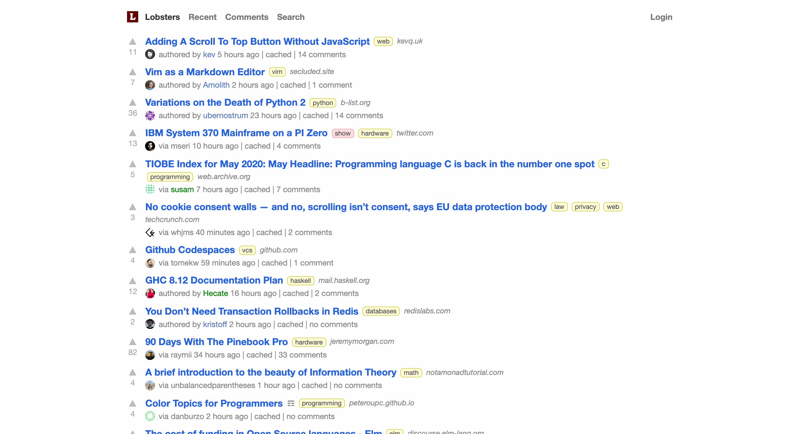

# News Alerts

## Índice

- [1. Preámbulo](#1-preambulo)
- [2. Resumen del proyecto](#2-resumen-del-proyecto)
- [3. Consideraciones generales](#3-consideraciones-generales)
- [4. Objetivos de aprendizaje](#4-objetivos-de-aprendizaje)
- [5. Criterios de aceptación mínimos del proyecto](#5-criterios-de-aceptacion-minimos-del-proyecto)
- [6. Consideraciones técnicas](#6-consideraciones-tecnicas)

***

## 1. Preámbulo

[Hacker News](http://hackerne.ws/) y [Lobsters](https://lobste.rs/) son agregadores
de noticias sobre tecnología, todos los días en cada momento unx puede visitar esos
sitios web y encontrar las últimas noticias respecto a temas de programación y tecnología
en general listadas en forma de links. Cada link lleva a la fuente original por
lo que siempre se garantiza tener la última versión de la noticia.

También, tienen un sistema de popularidad donde la primera noticia listada será
la que tiene mayor cantidad de votos a favor (_upvotes_) y todavía es relativamente
nueva. Las noticias van posicionadas, entonces, en un ranking muy simple de entender.
Una persona registrada puede votar por cada noticia para ayudar en este ranking.

Uno de los problemas que presentan estas plataformas es que si bien unx se entera
de todas las noticias, no hay (que sepamos) una forma de enterarte sobre temas específicos.

¿No sería genial que si una persona está interesada sobre las noticias del último
Framework JavaScript se pueda enterar solo de noticias relacionadas a ese tema mediante
una notificación?

## 2. Resumen del proyecto

En este proyecto vamos a tratar de crear un sistema de alertas para estos agregadores
de noticias.

Crédito: [Pxfuel](https://pxfuel.com/)

Una manera de enviar alertas a lxs usuarixs es mediante notificaciones, si bien
para enviar notificaciones podemos usar el sistema nativo de notificaciones de cada
sistema operativo, también podemos enviar una notificación mediante un correo electrónico
o mensajes de texto o un canal de Slack donde las personas interesadas estén conectadas
o incluso una mención en Twitter o alguna red social.

Entonces, nuestro sistema deberá poder registrar los keywords de nuestrxs usuarixs
de cierta manera; para simplificar el desarrollo podríamos enfocarnos en un tema
en específico primero, por ejemplo la palabra "React". Luego, el sistema debería
de preguntar cada cierto tiempo a alguno de estos agregadores (bajo tu elección)
si tiene alguna noticia con respecto a esta palabra, si la encuentra, y ya no envió
una notificación al respecto antes, entonces debería enviar una notificación a alguno
de los canales que previamente lx usuarix eligió.

Para efectos del aprendizaje no es necesario crear una interfaz web que registre
las preferencias de lxs usuarixs. Podemos empezar con 2 supuestos, buscar noticias
para la palabra "React" y mostrar notificaciones mediante correo electrónico, mensajes
de texto, algún canal de Slack o una red social como Twitter.

Por lo que vas leyendo podríamos asumir que ya te hiciste una idea que este sistema
deberá correr en el back-end, si no es así te recomendamos que revises otros proyectos
back-end primero.

## 3. Consideraciones generales

- Este proyecto se debe resolver en equipos de 2 o más personas.
- Si bien se menciona Hacker News o Lobsters por ser los más populares, puedes elegir
trabajar con otros agregadores de noticias. Estos 2 son los que nos parece más fáciles
de [_scrapear_](https://es.wikipedia.org/wiki/Web_scraping).
- Este proyecto es "agnóstico" a la tecnología que uses, es decir puedes desarrollarlo
en Vanilla JavaScript o algún _framework_  o biblioteca (librería) de tu elección.
- Intenta pensar en un alcance que, considerando su complejidad y la cantidad de
personas en el equipo, permita terminar el proyecto en 3 semanas.

## 4. Objetivos de aprendizaje

- Diseñar y testear un producto antes de desarrollarlo.
- Poner en práctica todo lo aprendido hasta ahora.
- Obtener datos de una fuente viva como lo es un sitio web usando alguna técnica
de [_web scrapping_](https://es.wikipedia.org/wiki/Web_scraping).
- Aprender a enviar notificaciones a lx usuarix mediante algún servicio de mailing,
chat o redes sociales.
- Aprender a agendar tareas repetitivas en el tiempo de nuestro programa usando
alguna API nativa de Node.js o algún library.

## 5. Criterios de aceptación mínimos del proyecto

- Obtener los datos a procesar de algún agregador de noticias.
- Obtener estos datos de manera periódica y automática, mientras el programa este
corriendo.
- Enviar notificaciones a lxs usuarixs mediante algún servicio de mailing, SMS,
chat o red social.
- No enviar notificaciones repetidas.
- Iterar por lo menos 1 vez con el prototipo y hace una refactorización del código.

## 6. Consideraciones técnicas

- Para poder obtener los datos de un sitio web vas a necesitar conocer sobre [_web
scrapping_](https://es.wikipedia.org/wiki/Web_scraping), en Node.js se puede lograr
usando en conjunto el _library_ llamado [axios](https://es.wikipedia.org/wiki/Web_scraping)
para hacer el request del HTML y uno llamado [cheerio](https://cheerio.js.org/)
que nos permitirá obtener solo los datos en los que estamos interesados de ese HTML.
- Para poder correr tareas periódicamente en el servidor tendrás que conocer de
los procesos del tipo [_daemon_](https://es.wikipedia.org/wiki/Daemon_(inform%C3%A1tica))
y los [cron jobs](https://es.wikipedia.org/wiki/Cron_(Unix)) que nos permitirán
ejecutar constantemente una acción. En Node.js esto se puede lograr con el
library [node-cron](https://www.npmjs.com/package/node-cron).
- Para poder enviar notificaciones a lxs usuarixs vas a tener que usar un servicio
de terceros, te tocará usar un _library_ que permite usar estos servicios, por
ejemplo [Twitter tiene uno](https://www.npmjs.com/package/twitter) que permite
enviar mensajes a la red social. Existen otros para enviar [mensajes de texto](https://www.npmjs.com/package/trello),
[mensajes por chat](https://www.npmjs.com/package/slack) o [correo electrónico](https://www.npmjs.com/package/mailchimp-api-v3).
- Si deseas usar alguna otra alternativa a las presentadas en los anteriores 3 puntos
también siéntete en la libertad de hacerlo.
